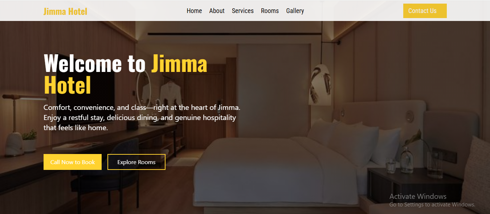
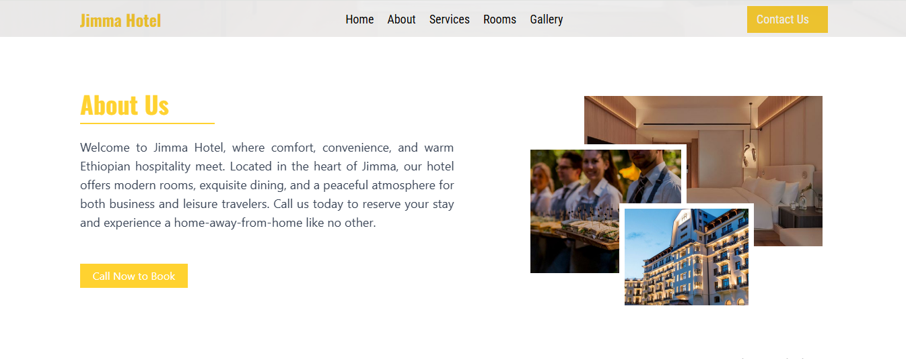
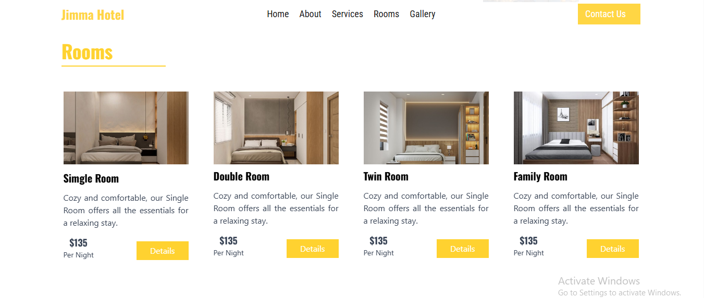
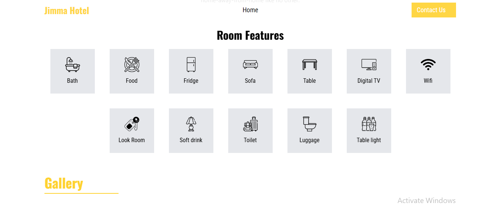
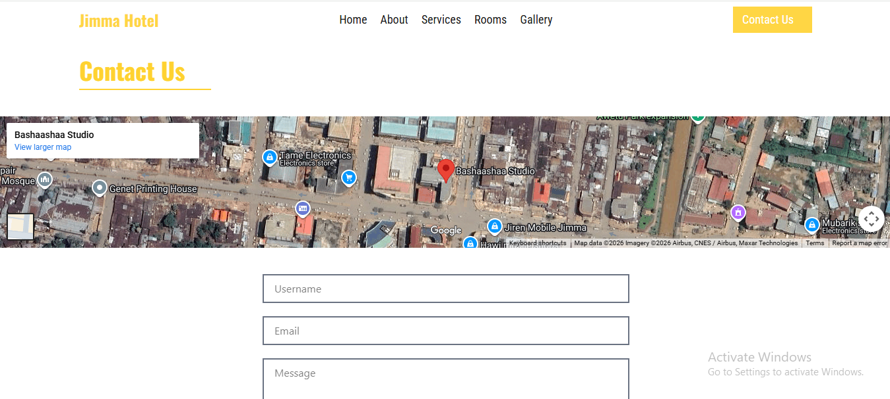
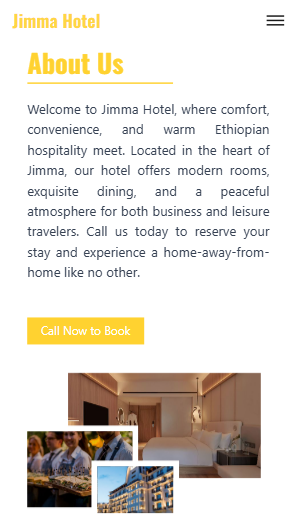

# Jimma Hotel 

Jimma Hotel is a responsive sample hotel website designed to present hotel information, services, and room details with a clean user interface and smooth animations. The project focuses on user interaction, accessibility, and modern frvontend practices.

## Key Features
- Responsive design for desktop and mobile devices
- Single-page experience for room details
- Dedicated sections for Home, About, Services, and Contact
- Room features and detailed room information pages
- Customer interaction through a contact form
- Smooth scroll and page animations using AOS
- Direct booking via a “Call Now to Book” button

## Technologies Used
- HTML
- Tailwind CSS
- React
- AOS (Animate On Scroll)
- EmailJS
- Vite

## Screenshots

### Home


### About


### Services


### Rooms (Single Page)


### Room Features


### Contact


### Responsive View


## Note
-This project is a sample / portfolio website
-Booking is handled via phone call for simplicity
-No online payment system included

## Author
### Firaol
-Computer Science and Engineering Student | Web Developer | webAR Developer

## 🚀 Run Locally
```bash
git clone https://github.com/firaol-12/Jimma_Hotel.git
cd frontend
npm install
npm run dev